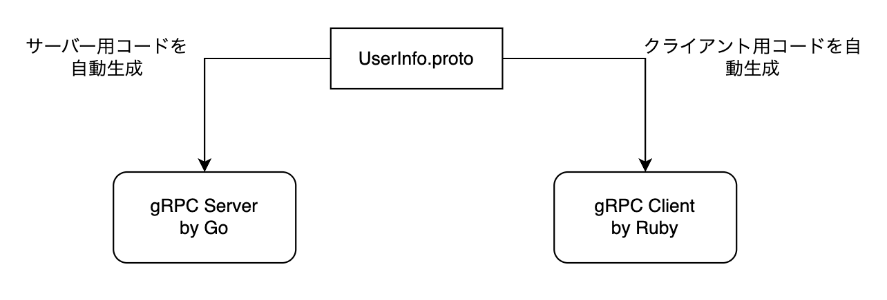
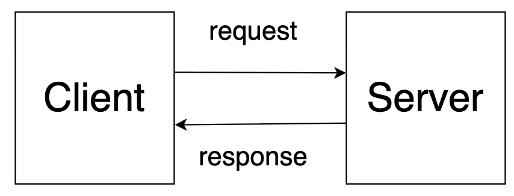
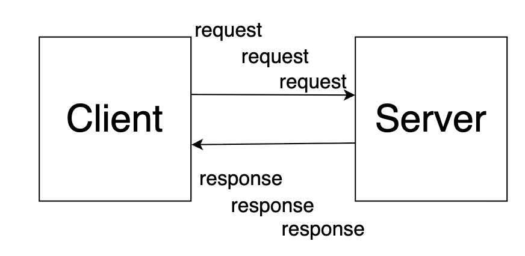

<!-- _class: titlepage -->

## REST 開発者のための <br> Go による gRPC 開発入門

---

## はじめに

今日はお越しいただきまことにありがとうございます。

この講座は REST での API 開発を行ってきたが、 gRPC による API 開発は経験がない。  
マイクロサービスアーキテクチャでよく耳にする gRPC だが実際にどのようなものか？
開発の始め方はどういうものか？
を知りたいなという人に向けてハンズオン形式で学べる資料を作りました。

---

## 自己紹介

小山由人（こやまよしひと）と申します。

株式会社 UPSIDER 所属のソフトウェアエンジニアです。

2017 年にキャリアをスタートし、 REST API の開発をしてきました。

2024 年から UPSIDER にうつり、 gRPC を使った API の開発に携わっています。

---

## アジェンダ

- gRPC ってなんだ？ REST との比較
- proto ファイルを書いてみよう 
- Go で gRPC サーバーを実装してみよう 
- Go で gRPC クライアントを実装してみよう 
- エラーコードについて 
- まとめ

---

# gRPC ってなんだ？ REST との比較

---

## gRPC とは

gRPC とは Google が開発した RPC (Remote Procedure Call) フレームワークです。

RPC は直訳すると遠隔の手続き（関数）を呼び出す行為
REST のようにURLやHTTPメソッドでリソースを操作するのではなく、関数名と引数で API を呼び出す
こんな感じに定義された関数を呼び出します。

`rpc Hello (HelloRequest) returns (HelloResponse);`

Hello が関数名、 HelloRequest が引数、 HelloResponse が戻り値です。

---

## gRPC とは

g の意味は実はバージョンごとに異なる（good とか green とか）

https://grpc.github.io/grpc/core/md_doc_g_stands_for.html

---

## gRPC とは

gRPC は複数のプログラミング言語（Go、Java、PHP、Python）と複数のプラットフォーム（Linux、macOS、Windows、iOS、Android）に対応しています。

Protocol Buffers という特定のプログラミング言語に依存しない言語を利用します。

こんな感じ。
```protobuf
message SayHelloRequest {
  string name = 1;
}
```

SayHelloRequest という型を独自定義している。

SayHelloRequest は文字列型の name というフィールドを持っています。

---

## gRPC とは

<!-- _class: img-w60 -->


こういった型を .proto 拡張子がつく proto ファイルに定義します。
.proto ファイルは任意の言語のクライアント/サーバー用コードにコンパイルすることができます。

スキーマファーストの開発になるのでAPI仕様書がない、情報が古いままだったという齟齬が発生しづらいです。

---

## gRPC とは

gRPC のもう一つの特徴として HTTP/2 を利用した高速通信があります。
REST で開発する際は HTTP/1.1 を利用することが多いです。
gRPC は HTTP/2 を利用することで以下のようなメリットがあります。
HTTP/2 は従来の HTTP/1.1 と違い
- 通信するときに情報がテキストでなくバイナリにシリアライズされて送られデータ量が圧縮されるためリソースが効率的に使用される
- １つの TCP コネクションで複数のリクエスト/レスポンスのやりとりを行うので効率的な通信になる

そのため gRPC は REST （HTTP/1.1）に比べて高速に通信できます。

---

## gRPC とは

gRPC はストリーミングにも対応しています。
ざっくり言うとストリーミングは「1回のコネクションを張りっぱなしにして、複数のメッセージを継続的にやり取りする方式」です。
REST APIでは「1リクエスト＝1レスポンス」なのに対し、ストリーミングは同じ呼び出しの中で何度も送受信できます。

---

## gRPC とは

gRPC で対応できる通信方式は以下の４つです。
- Unary RPC
- Server streaming RPC
- Client streaming RPC 
- Bidirectional streaming RPC 


---

## Unary RPC

<!-- _class: img-w60 -->


- クライアントとサーバーのリクエストとレスポンスが１対１

---

## Server streaming RPC

<!-- _class: img-w60 -->


- クライアントのリクエストに対してサーバーが複数のレスポンスを返す。

---

## Client streaming RPC

<!-- _class: img-w60 -->


- クライアントからサーバーに対して複数のリクエストを送る。


---

## Bidirectional streaming RPC

<!-- _class: img-w60 -->


- クライアントからはじめのリクエストが送られたあと、クライアントとサーバーはどちらも任意のタイミングでリクエストとレスポンスをやりとりできる。

---

## gRPC とは

REST API ではストリーミングの対応ができず、別途 WebSocket サーバーを立てる必要がありますが gRPC であれば単一サーバーで双方向通信にも対応ができます。

---

## REST との比較

REST はリソースを中心に、リソースに対する操作をHTTPメソッド（GET、POST、PATCH、DELETEなど）で表現をする。
リソースは一般的にはJSONで表現される。

また REST は設計原則であり規格ではなく、実装者がその原則に従って自分で仕様を決めることができます。

※ そのため REST の原則を守っていない単なる HTTP を使う Web API も多い

一方、 gRPC は関数を中心に、関数名と引数、戻り値で API を表現し、自動生成されたコードを呼び出す形で API を利用する。

gRPC では proto ファイルの仕様や、自動生成されたコードの仕様を学び、それに従う必要があります。

---

## REST との比較

| 観点      | REST                  | gRPC                    |
| ------- | --------------------- |-------------------------|
| プロトコル   | HTTP/1.1              | HTTP/2                  |
| データ形式   | JSON (テキスト)           | Protocol Buffers (バイナリ) |
| パフォーマンス | シリアライズ/デシリアライズに時間がかかる | 軽量で高速            |
| 可読性     | 高い（人間が直接読める）          | 低い（バイナリなので人間は読みにくい）     |
| ストリーミング | 基本的にリクエスト/レスポンス1回     | ストリーミングにも対応             |
| 開発体験    | シンプル、学習コスト低い          | proto定義やツール学習が必要        |
| エコシステム  | 豊富                    | 拡大中                     |

---

## gRPC の課題

- gRPC (HTTP/2) 対応していないケース
    - HTTP/2 に対応していない技術がまだあり HTTP/2 非対応問題で開発が難航する可能性がある
    - ブラウザ <-> サーバー間の通信に利用される例はまだ少ない
- 言語により実装状況にばらつきがある
    - .proto ファイルによって生成されるコードが言語によって一部機能非対応であったりする
- 外部公開には REST のほうが向いている
    - ほぼすべての言語・フレームワークに REST/HTTP クライアントがある
    - gRPC だと「protobufを理解してツールを入れて…」と準備が必要で、学習コストが障壁になる
- REST でも十分はやい
    - 秒間数千件程度であれば REST でも十分高速
    - パフォーマンス観点ではデータベースやキャッシュ戦略も重要

---

# proto ファイルを書いてみよう

---

## proto ファイルを書いてみよう

gRPC では Protocol Buffers を使用してサービスのインターフェースを定義します。

.proto を拡張子とするファイルにサービスのメソッド、リクエストとレスポンスの型を定義します。

.proto ファイルは gRPC サービスのインターフェースを定義するためのものです。

---

## proto ファイルを書いてみよう

例えばこんな感じ。

```protobuf
syntax = "proto3";

option go_package = "gen/grpc";

package greeting;

service Greeter {
  rpc SayHello (HelloRequest) returns (HelloResponse);
}

message HelloRequest {
  string name = 1;
}

message HelloResponse {
  string message = 1;
}
```

---

## proto ファイルを書いてみよう

では、１つずつ解説していきます。

---

### syntax
`syntax = "proto3";` は Protocol Buffers のバージョン
現在は proto2 と proto3 があるが、今回は最新の proto3 を使う

### option go_package
`option go_package = "gen/grpc";` は Go で生成されるコードのパッケージ名

### package

`package greeting;` は .proto ファイル内で定義されるメッセージやサービスの名前空間

---

### service
- `service Greeter { ... }` は gRPC サービスを定義
    - `rpc SayHello (HelloRequest) returns (HelloResponse);` は SayHello という RPC メソッドを定義
    - 引数は HelloRequest 型
    - 戻り値は HelloResponse 型
    - 1 つの service に複数の RPC メソッドを定義できる

---

### message
message とは構造化されたデータ型のこと
- `message HelloRequest { ... }` は HelloRequest というメッセージ型を定義
    - `string name = 1;` は name というフィールドを定義。
    - string は文字列型を意味する。
    - 1 というようにフィールド番号を指定する
- `message HelloResponse { ... }` は HelloResponse というメッセージ型を定義
    - `string message = 1;` は message というフィールドを定義。

---

### import

ほかの .proto ファイルを import して利用することもできる

```protobuf
// other.proto file
syntax = "proto3";

package other;

message OtherRequest {
  int32 id = 1;
  string info = 2;
}
```

```protobuf
// hello.proto file
syntax = "proto3";

import "other.proto";

message HelloRequest {
  string name = 1;
  other.OtherRequest other = 2; // other.proto で定義された OtherMessage を利用
}
```

---

## proto ファイルを書いてみよう

以上のように proto ファイルにサービスのメソッド、リクエストとレスポンスの型を定義することから gRPC 開発は始まります。

proto ファイル内に定義できることをもう少し解説していきます。

---

## スカラー型とメッセージ型

Protocol Buffers では値に型を定義します。
型には大きく分けてスカラー型とメッセージ型があります。

---

### スカラー型とは
スカラー型とは「基本的なデータ型」のこと。
Protocol Buffers で利用できるスカラー型は例えば以下のようなものがあります。

| 型       | 説明                              |
|----------|-----------------------------------|
| double   | 64ビットの浮動小数点数             |
| float    | 32ビットの浮動小数点数             |
| int32    | 32ビットの符号付き整数             |
| bool     | 真偽値                            |
| string   | UTF-8 文字列または 7 bit ASCII 文字列 |
| bytes    | 任意のバイト配列                   |

---

### メッセージ型とは

メッセージ型とは、フィールドを持つ構造化されたデータ型のこと。

```protobuf
syntax = "proto3";

message User {
  int32 id = 1;
  string name = 2;
  string email = 3;
}
```

- メッセージ型は１つのprotoファイル内で複数定義できる。
- 各フィールドにはスカラー型や他のメッセージ型を指定できる。
- フィールドごとにユニークな番号を指定する必要がある。
- この番号はフィールドを識別するために使われる。

---

### メッセージ型とは

運用中にフィールドを削除する場合、思わぬトラブルを避けるために番号を再利用せずに新しい番号を割り当てる必要があります。
不要になるフィールドは deprecated オプションをつけて非推奨とするか、 reserved で他の開発者が誤って使わないことができます。

```protobuf
syntax = "proto3"; 

message User {
  int32 id = 1;
  string name = 2;
  string email = 3 [deprecated = true]; // email フィールドは非推奨
  reserved 4, 5; // フィールド番号 4 と 5 は予約済みなので使用できない
}
```

最大フィールド数や予約番号などの制約はありますが今回の講義では説明を省略します。

---

### repeated フィールド

配列を定義するときには `repeated` キーワードを使います。

```protobuf
syntax = "proto3";

message User {
  int32 id = 1;
  string name = 2;
  repeated string tags = 3; // tags フィールドは文字列の配列
}
```

---

### enum

列挙型を定義するときには `enum` キーワードを使います。

```protobuf
syntax = "proto3";

enum Status {
  UNKNOWN = 0; // デフォルト値。先頭は必ず 0 にする
  ACTIVE = 1;
  INACTIVE = 2;
  BANNED = 3;
}

message User {
  int32 id = 1;
  string name = 2;
  Status status = 3; // status フィールドは Status 列挙型
}
```

---

### map
マップ型を定義するときには `map<key_type, value_type>` を使います。

```protobuf
syntax = "proto3";

message User {
  int32 id = 1;
  string name = 2;
  map<string, int32> scores = 3; // scores フィールドは文字列をキー、整数を値とするマップ
}
```

---

### oneof

`oneof` キーワードを使うと複数のフィールドのうち１つだけが設定されることを保証できます。

```protobuf
syntax = "proto3";

message Contact {
  oneof contact_info {
    string email = 1;
    string phone = 2;
  }
}
```

---

### Well Known Types

Protocol Buffers にはよく使われるデータ型をあらかじめ定義した「Well Known Types」があります。

これらは Google が提供する標準的なメッセージ型で、よく使われるデータ構造を簡単に扱うことができます。

- `google.protobuf.Timestamp`: タイムスタンプを表す
- `google.protobuf.Duration`: 時間の長さを表す
- `google.protobuf.Empty`: 空のメッセージを表す

---

# gRPC サーバーを Go で実装

---

## 前提条件

Go 1.25 を使用します。

---

### 準備

必要なツールをインストールしましょう。

proto ファイルからコードを生成するために protoc を使います。

```bash
# Protocol Buffers コンパイラ
brew install protobuf
# インストール 確認
which protoc
```

次に、 Go 用の gRPC プラグインをインストールします。
```bash
# Go 用の gRPC プラグインインストール
go install google.golang.org/protobuf/cmd/protoc-gen-go@latest
go install google.golang.org/grpc/cmd/protoc-gen-go-grpc@latest
# インストール確認
which protoc-gen-go
which protoc-gen-go-grpc
```

---

### proto ファイルを作ってみよう

任意のディレクトリを作成
```bash
mkdir grpc-hands-on
cd grpc-hands-on
```

proto ファイルを保存するディレクトリを作成
```bash
mkdir proto
```

proto 下に hello.proto ファイルを作成
```bash
touch proto/hello.proto
```

---

hello.proto に以下を記述
```protobuf
syntax = "proto3";

option go_package = "gen/grpc";

package myapp;

service GreetingService {
  rpc Hello (HelloRequest) returns (HelloResponse);
}

message HelloRequest {
  string name = 1;
}

message HelloResponse {
  string message = 1;
}
```

---

自動生成されるファイルの保存先ディレクトリを作成
```bash
mkdir -p gen/grpc
```

では protoc コマンドで Go コードを自動生成します。

```bash
cd protoc
protoc --go_out=../gen/grpc --go_opt=paths=source_relative \
        --go-grpc_out=../gen/grpc --go-grpc_opt=paths=source_relative \
        hello.proto
```

---

コマンドの解説をします。

- `--go_out=../gen/grpc`: メッセージ型の Go コードを gen/grpc ディレクトリに出力
- `--go_opt=paths=source_relative`: 出力先のパスを実行した proto ファイルに対して相対パスにする
- `--go-grpc_out=../gen/grpc`: gRPC サービスの Go コードを gen/grpc ディレクトリに出力
- `--go-grpc_opt=paths=source_relative`: 出力先のパスを実行した proto ファイルに対して相対パスにする

---

これで gen/grpc ディレクトリに以下の２つのファイルが生成されます。
- `hello.pb.go`: メッセージ型の Go コード
- `hello_grpc.pb.go`: gRPC サービスの Go コード

生成されるファイルを確認してみましょう。

---

たとえば HelloRequest は proto ファイルでは name フィールドをもつメッセージ型として定義されていました。

```protobuf
syntax = "proto3";

message HelloRequest {
  string name = 1;
}
```

生成された hello.pb.go ファイルでは以下のような Go の構造体として表現されます。

```go
type HelloRequest struct {
	state         protoimpl.MessageState `protogen:"open.v1"`
	Name          string                 `protobuf:"bytes,1,opt,name=name,proto3" json:"name,omitempty"`
	unknownFields protoimpl.UnknownFields
	sizeCache     protoimpl.SizeCache
}
```

---

また、構造体にはいくつかのレシーバが定義されています。

たとえば、 Name フィールドの値を取得するための GetName メソッドが定義されています。
```go
func (x *HelloRequest) GetName() string {
    if x != nil {
        return x.Name
    }
    return ""
}
```

---

では service に定義された RPC メソッドはコンパイル後はどのように表現されるでしょうか？

```protobuf
service GreetingService {
  rpc Hello (HelloRequest) returns (HelloResponse);
```

GreetingService は hello_grpc.pb.go ファイルで以下のように定義されています。
まずはサーバーサイドで利用する箇所を見ていきます。

```go
type GreetingServiceServer interface {
	Hello(context.Context, *HelloRequest) (*HelloResponse, error)
	mustEmbedUnimplementedGreetingServiceServer()
}
```

---

```go
type GreetingServiceServer interface {
	Hello(context.Context, *HelloRequest) (*HelloResponse, error)
	mustEmbedUnimplementedGreetingServiceServer()
}
```

`GreetingServiceServer` インターフェースが定義されており、 Hello メソッドが含まれています。
このインターフェースを継承するようなサーバー側の実装を自分で作成することで gRPC サーバーがつくれます。

`mustEmbedUnimplementedGreetingServiceServer()` ですが、これは別箇所で定義されている `UnimplementedGreetingServiceServer` 構造体を埋め込むことを強制するためのダミーのメソッドです。

---

```go
type UnimplementedGreetingServiceServer struct{}

func (UnimplementedGreetingServiceServer) Hello(context.Context, *HelloRequest) (*HelloResponse, error) {
	return nil, status.Errorf(codes.Unimplemented, "method Hello not implemented")
}
func (UnimplementedGreetingServiceServer) mustEmbedUnimplementedGreetingServiceServer() {}
```

`UnimplementedGreetingServiceServer` を埋め込まない場合、たとえば `Hello2` という新しい RPC メソッドが追加されたときに `GreetingServiceServer` インターフェースには `Hello2` が追加されるが、自身の実装には `Hello` しかないためビルドエラーになります。
この `UnimplementedGreetingServiceServer` を埋め込むことで、将来 `GreetingService` に新しい gRPC のメソッドが追加された場合でもビルドが壊れないようになります。

---

このことは自動生成されるコード内にもコメントで説明されています。

> UnimplementedGreetingServiceServer must be embedded to have forward compatible implementations.

---

## サーバー側の実装

では、サーバー側の実装をしていきましょう。

今回サーバー側でやることは

- サーバー側のモジュールの準備
- proto ファイルから生成された service のロジックを実装するサービスの実装
- クライアントからのリクエストを受け付けるようサーバーの実装

です。

---

## サーバー側の実装

go のプロジェクトを初期化し、必要なライブラリをインストールします。
```bash
go mod init github.com/yourusername/grpc-hands-on
go get -u google.golang.org/grpc 
go get -u google.golang.org/grpc/cmd/protoc-gen-go-grpc
```

サーバーの実装は cmd/server に main.go ファイルを作成して以下のように記述します。

```bash
mkdir -p cmd/server
touch cmd/server/main.go
```

---

まず、`GreetingServiceServer` インターフェースを実装するサーバーを作成してみます。

まずは、サーバーの構造体を作ります。
このとき `UnimplementedGreetingServiceServer` を埋め込みます。

```go
// 前方互換性をたもつために UnimplementedGreetingServiceServer を埋め込む
type myServer struct {
    pb.UnimplementedGreetingServiceServer
}

// サーバーのコンストラクタ
func NewMyServer() *myServer {
    return &myServer{}
}
```

---

次に myServer の Hello メソッドの振る舞いを定義します。
今回は HelloRequest の Name フィールドを受け取り、HelloResponse の Message フィールドに "Hello, {Name}!" というメッセージを返すようにします。

```go
func (s *myServer) Hello(ctx context.Context, req *pb.HelloRequest) (*pb.HelloResponse, error) {
    log.Printf("received: %v", req.GetName())
    return &pb.HelloResponse{
        Message: fmt.Sprintf("Hello, %s!", req.GetName()),
      }, nil
}
```
---

次に、 gRPC サーバーを起動するコードを書いてみます。

```go
func main() {
    port := 8080
    listener, err := net.Listen("tcp", fmt.Sprintf(":%d", port))
    if err != nil {
        log.Fatalf("failed to listen: %v", err)
    }
    
    server := grpc.NewServer()
    pb.RegisterGreetingServiceServer(server, NewMyServer())
    
    reflection.Register(server)
    
    if err := server.Serve(listener); err != nil {
        log.Fatalf("failed to serve: %v", err)
    }
}
```

---

ここで重要なのはこちらです。

```go
server := grpc.NewServer()
pb.RegisterGreetingServiceServer(server, NewMyServer())
```

`grpc.NewServer()`で生成される server は gRPC のサーバインスタンスです。
まだリッスンもしていません。
ちなみに、NewServerの引数にはオプションを設定でき、最大の送受信データ量の変更やログ・認可などのミドルウェアの指定ができます。

---

`RegisterGreetingServiceServer` は自動生成した hello_grpc.pb.go ファイルに定義されています。

gRPC の server を RegisterGreetingServiceServer の第一引数に、第二引数には今回作成した GreetingServiceServer インターフェースを実装するサーバーを渡すことで server に GreetingService が登録されます。

これらの作業をサーバー起動前に実施することでこの gRPC サーバーは Hello という RPC メソッドを提供できるようになります。

---

では、このサーバーを起動してみましょう。

```bash
% go run cmd/server/main.go
2025/08/28 16:33:18 let's start gRPC server with port: 8080
```

起動できました。

---

### 動作確認

動作確認ですが gRPC クライアントを Go で実装する方法もありますが、今回はコマンドラインツールの grpcurl を使って確認します。

```bash
brew install grpcurl
```

grpcurlは、gRPCサーバーに対してコードを書かずにリクエストを送れる cURL 風のCLIです。

---

なお、grpcurl は gRPC サーバーが提供するサービスの情報を取得するためにサーバーのリフレクション機能を利用します。
先ほど実装したサーバー側の実装でも

```go
reflection.Register(server)
```

と記述をすることで grpcurl でアクセスができます。
実は proto ファイルが有ればサーバー側にリフレクション機能がなくてもアクセスできますが、今回はサーバー側にリフレクション機能を実装しています。

---

では、grpcurl でサーバーにアクセスしてみましょう。

まずは list コマンドを実行していましょう。
```bash
grpcurl -plaintext localhost:8080 list
grpc.reflection.v1.ServerReflection
grpc.reflection.v1alpha.ServerReflection
myapp.GreetingService
```
v1.ServerReflectionと v1alpha.ServerReflection はリフレクション用のサービスです。

myapp.GreetingService は proto ファイルで定義したサービスです。

無事に作成したサービスが登録された状態で gRPC サーバーが起動していることがわかります。

---

次に describe コマンドで GreetingService の詳細を確認してみます。

```bash
grpcurl -plaintext localhost:8080 describe myapp.GreetingService
myapp.GreetingService is a service:
service GreetingService {
  rpc Hello ( .myapp.HelloRequest ) returns ( .myapp.HelloResponse );
}
````
GreetingService には Hello という RPC メソッドがあり、引数は HelloRequest、戻り値は HelloResponse であることがわかります。

---

では、実際に Hello メソッドを呼び出してみましょう。

```bash
grpcurl -plaintext -d '{"name": "Golden Retriever Pan Cakes"}' localhost:8080 myapp.GreetingService/Hello
{
  "message": "Hello, Golden Retriever Pan Cakes!"
}

```
リクエストに json で指定した name フィールドの値がレスポンスの message フィールドに反映されていることがわかります。

なお、grpcurl 以外にも Postman などの GUI ツールでも gRPC サーバーにアクセスできますので好きなツールを使ってみてください。

---

# gRPC クライアントを Go で実装

---

## gRPC クライアントを Go で実装

gRPC サーバーを呼び出すためのクライアントコードを実装してみましょう。

次のような仕様とします。
```
このクライアントを実行すると、「gRPC クライアントを開始した」旨のメッセージが標準出力される。
画面の案内に従って、任意の名前を入力して Enter を押す。
クライアントはその名前をサーバへ送り、サーバからの応答メッセージを受け取って表示します。
入力→送信→表示を何度でも繰り返せます。終了したいときはターミナルで Ctrl+C を押します。
```

クライアント側の実装は cmd/client に main.go ファイルを作成して以下のように記述します。

```bash
mkdir -p cmd/client
touch cmd/client/main.go
```

---

main.go には以下のように記述をします。

```go
// 一部略
package main

func main() {
  fmt.Println("gRPC クライアントを起動するよ...")

  target := "localhost:8080"
  conn, err := grpc.NewClient(
    target,
    grpc.WithTransportCredentials(insecure.NewCredentials()),
  )

  if err != nil {
    log.Fatal("Connection failed.")
    return
  }
  defer conn.Close()

  client := pb.NewGreetingServiceClient(conn)

  for {
    fmt.Print("好きな名前を入力してエンターキーを押してね: ")
    var name string
    fmt.Scan(&name)

    req := &pb.HelloRequest{
      Name: name,
    }

    res, err := client.Hello(context.Background(), req)
    if err != nil {
      fmt.Printf("gRPC サーバーから返答がこないよ: %v\n", err)
      break
    }
    fmt.Printf("やった！ gRPC サーバーから返答がきたよ: %s\n\n", res.GetMessage())

  }
}
```

---

ポイントになるのはこちら。
```go
	target := "localhost:8080"
	conn, err := grpc.NewClient(
		target,
		grpc.WithTransportCredentials(insecure.NewCredentials()),
	)
```

NewClient で gRPC サーバーへのコネクションを作成しています。
target に接続先のアドレスをしていします。

たとえばマイクロサービスの別namespace間の通信であれば、<serviceName>.<namespace>.svc.cluster.local:8080 のように Kubernetes のサービス名で指定することもできます。

grpc.WithTransportCredentials(insecure.NewCredentials()) は TLS を使わない設定です。

---

作成した connection を使ってクライアントを作成します。
```go
	client := pb.NewGreetingServiceClient(conn)
```

NewGreetingServiceClient は protoc で生成された hello_grpc.pb.go ファイルに定義されています。

これを利用することで GreetingService のサーバーにアクセスするクライアントが作成できます。

---

### クライアントを実行

では実際に動かしてみましょう。

まずはサーバーを起動して

```bash
go run cmd/server/main.go
```

次に別ターミナルでクライアントを起動します。

```bash
go run cmd/client/main.go
```

クライアントの画面指示に従って入力するとサーバーからのレスポンスが返ってくるはずです。

サーバー側にもクライアントからリクエストを受け取ったログが出力されているはずです。

---

# エラーハンドリング

---

## エラーハンドリング

gRPC ではエラーハンドリングのためにステータスコードとエラーメッセージを利用します。

簡単にですがエラーコードの紹介と実際にサーバーとクライアントでどのようにエラーを処理するのかを説明します。

---

## エラーコード
すべての RPC コールはステータスコードを返します。
ステータスは 0 ~ 16 番までの整数値です。

| 番号 | コード名             |
|------|------------------|
| 0    | OK               |
| 1    | Canceled         |
| 2    | Unknown          |
| 3    | InvalidArgument  |
| 4    | DeadlineExceeded |
| 5    | NotFound         |
| ...  | ...              |
| 16   | Unauthenticated  |

---

### エラーハンドリング（サーバー側）
Go の場合は google.golang.org/grpc/codes と google.golang.org/grpc/status を利用してエラーを返します。

```go
package main

import (
	"google.golang.org/grpc/codes"
	"google.golang.org/grpc/status"
// 略
)
// SayHello implements helloworld.GreeterServer.
func (s *server) SayHello(ctx context.Context, in *pb.HelloRequest) (*pb.HelloReply, error) {
  if in.Name == "" {
    return nil, status.Errorf(codes.InvalidArgument, "request missing required field: Name")
  }
  // 略
}
```
参考：
https://github.com/grpc/grpc-go/tree/master/examples/features/error_handling

---

### エラーハンドリング（クライアント側）
クライアント側でも google.golang.org/grpc/codes と google.golang.org/grpc/status を利用してエラーの種類の判別を行う。

```go
package main

import (
	"google.golang.org/grpc"
	"google.golang.org/grpc/codes"
	"google.golang.org/grpc/status"
)

// 略
    r, err := c.SayHello(ctx, &pb.HelloRequest{Name: reqName})
    if err != nil {
        if status.Code(err) != codes.InvalidArgument {
            log.Printf("Received invalid argument error: %v", err)
            continue
        }
        log.Printf("Received error: %v", err)
        continue
    }
    log.Printf("Received response: %s", r.Message)
	}
// 略
```

参考: https://github.com/grpc/grpc-go/tree/master/examples/features/error_handling

---

# まとめ

---

## まとめ

これで本日の講義は終了です。

gRPC の概要、 REST の比較から始めました。

REST はシンプルで学習コストが低い一方、 gRPC はスキーマファーストで型安全、高速、双方向ストリーミングが可能などの特徴があります。

また、 proto ファイルの書き方、 gRPC サーバーとクライアントの Go での実装方法、エラーハンドリングについても説明しました。

gRPC はハイパフォーマンスが求められるサービス間の通信やリアルタイム通信などに適しています。

興味があれば今日のハンズオンをぜひお手元で試してみてください。


