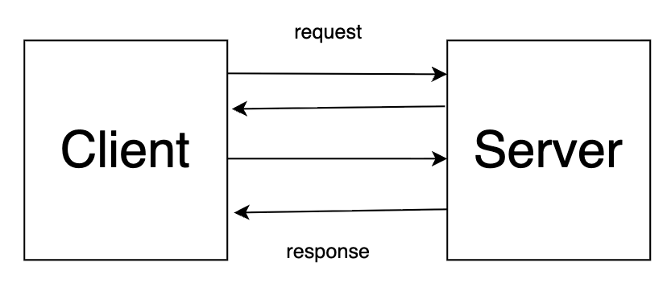

<!-- _class: titlepage -->

## gRPC の双方向通信を利用したリアルタイムクイズゲーム

---

## はじめに

gRPC では 4 つの通信モードがあります。

- Unary RPC: クライアントとサーバーのリクエストとレスポンスが１対１
- Server streaming RPC: クライアントのリクエストに対してサーバーが複数のレスポンスを返す。
- Client streaming RPC: クライアントからサーバーに対して複数のリクエストを送る。
- Bidirectional streaming RPC: クライアントからはじめのリクエストが送られたあと、クライアントとサーバーはどちらも任意のタイミングでリクエストとレスポンスをやりとりできる。

---

## はじめに

ここでは双方向通信を利用したリアルタイムクイズゲームのデモをします。

双方向通信ではクライアントとサーバーがリクエストとレスポンスのやりとりを複数回行えます。

<!-- _class: img-w50 -->


---

# クイズゲームの要件

---

## クイズゲームの要件

### 参加 / 初期同期

- 参加時にクライアントはサーバーにプレイヤー名を入力する
- 参加時にサーバは Welcome を返す
- 進行中の問題がある場合、新規参加者に限り現在の問題、既存のスコアボードを表示する
- プレイヤー参加/退出は Info で全員に通知。

---

## クイズゲームの要件

### 出題 / 進行
- 最初の参加者が現れたら出題を開始
- 問題はすべてで３つでサーバー側で管理
  - 問題1 日本の首都は？ 東京都
  - 問題2 日本一広い湖は？ 琵琶湖
  - 問題3 日本で一番高い山は？ 富士山
- 複数名が同時に参加して早押し形式で回答できる
  - b を入力することで早押し回答権をゲット
  - 回答権を得たプライヤー名を各プレイヤーに配信
  - 回答は「a 富士山」のように a スペース 回答 の形式で送信

---

## クイズゲームの要件

### 出題 / 進行

- 回答権者の回答を採点し、正解とスコアを配信
  - 正解なら 1 点加点、不正解なら加点なし
  - 正解・不正解にかかわらず回答後はスコアを配信して次の問題に進む
- すべての問題が終了したらゲーム終了
  - 全員にゲーム終了を通知する
  - 最終スコアを配信する

### 退室
- クライアントは任意のタイミングで退室できる
  - 退室したプレイヤー名を全員に配信する


---

<!-- _class: img-w40 -->


---

# 実行方法

---

## 実行方法

### サーバーの起動

```bash
go run ./cmd/server/main.go
2025/08/29 18:00:43 Quiz gRPC server listening on :8080
```

---
### クライアントの起動
別ターミナルでクライアントを起動
このターミナルをターミナル1とする
```bash
go run ./cmd/client/main.go
```

---
標準入力で名前を入力する
```bash
あなたの名前: yoshi
```

ウェルカムメッセージ、スコアが表示され、続けて最初の問題が表示される

```bash
あなたの名前: yoshi
[WELCOME] id=p-1756458110911168000 name=yoshi
[INFO] yoshi が参加しました
[SCORES]
  yoshi : 0

[Q1] 日本の首都は？
  -> 早押しは 'b'、回答は 'a your_answer'
```

---

別ターミナルで別のクライアントを起動する。
これをターミナル2とする。
名前を入力するとウェルカムメッセージとスコア、現在の問題が表示される

```bash
go run ./cmd/client/main.go
あなたの名前: koyama
[WELCOME] id=p-1756458171204862000 name=koyama
[INFO] koyama が参加しました

[Q1] 日本の首都は？
  -> 早押しは 'b'、回答は 'a your_answer'
[SCORES]
  yoshi : 0
  koyama : 0
```

---

もとのターミナルにて新規プレイヤーが参加したことが通知される
```bash
あなたの名前: yoshi
[WELCOME] id=p-1756458110911168000 name=yoshi
[INFO] yoshi が参加しました
[SCORES]
  yoshi : 0

[Q1] 日本の首都は？
  -> 早押しは 'b'、回答は 'a your_answer'
[INFO] koyama が参加しました
```

---

ターミナル1で早押しをする。
回答権獲得のメッセージが表示される

```bash
[Q1] 日本の首都は？
  -> 早押しは 'b'、回答は 'a your_answer'
[INFO] koyama が参加しました
b
[BUZZ] yoshi が回答権を獲得
```

正答を入力する。
正解した旨とスコアが表示され、次の問題が出題される。
```bash
a 東京都
[JUDGE] 正解！（正解: 東京都）
[SCORES]
yoshi : 1
koyama : 0

[Q2] 日本一広い湖は？
-> 早押しは 'b'、回答は 'a your_answer'
```

---

ターミナル2でもプレイヤーが回答権獲得したこと正解の結果、スコア、次の問題が表示される。

ターミナル2で早押しをして回答する。
今回は不正解を入力する。

```bash
[Q2] 日本一広い湖は？
  -> 早押しは 'b'、回答は 'a your_answer'
b
[BUZZ] koyama が回答権を獲得
a カスピ海
[JUDGE] 不正解…（正解: 琵琶湖）
[SCORES]
  yoshi : 1
  koyama : 0

[Q3] 日本で一番高い山は？
  -> 早押しは 'b'、回答は 'a your_answer'
```

---

結果はターミナル1でも同様に表示される。

最後にターミナル1で回答する。

正解の判定とスコア、そしてお疲れ様でしたのメッセージが表示される。

```bash
[Q3] 日本で一番高い山は？
  -> 早押しは 'b'、回答は 'a your_answer'
b
[BUZZ] yoshi が回答権を獲得
a 富士山
[JUDGE] 正解！（正解: 富士山）
[SCORES]
  yoshi : 2
  koyama : 0
[INFO] 全問終了！お疲れさまでした。
[SCORES]
  yoshi : 2
  koyama : 0
```

---

# 退出通知の確認

---

# 退出通知の確認

ゲームプレイがリアルタイムに進行することがわかったかと思います。

最後に、退出が他のプレイヤーに通知されることを確認します。

---

# 退出通知の確認

サーバーとクライアントを終了し、サーバーを再起動する。

```bash
go run ./cmd/server/main.go
2025/08/29 18:00:43 Quiz gRPC server listening on :8080
```

ターミナル1と2でクライアントを起動し、名前を入力する。

```bash
go run ./cmd/client/main.go
```

ターミナル1で q を入力するか Ctrl+C で終了する。

ターミナル2でターミナル1のプレイヤーが退出したことが通知される。
```bash
[INFO] yoshi が退出しました
```

